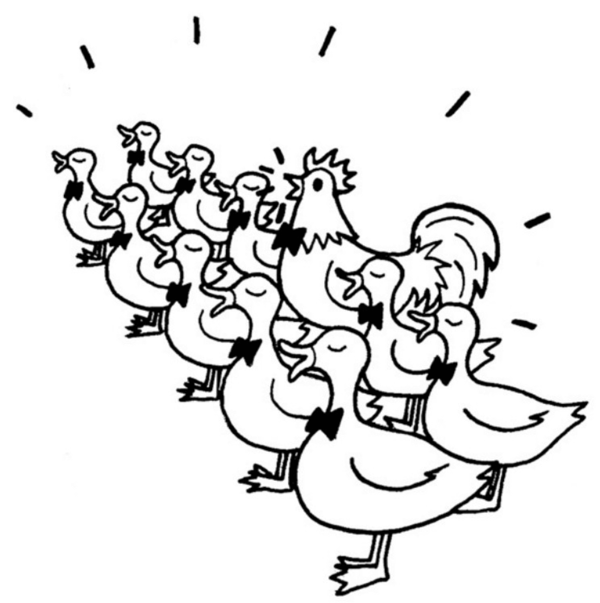

# 面向对象的js

## 动态类型和鸭子类型

编程语言按照数据类型大体可以分为两类，<sapn class="marker-text">一类是静态类型语言，另一类是动态类型语言。</sapn>


<sapn class="marker-text">静态类型语言在编译时便已确定变量的类型，而动态类型语言的变量类型要到程序运行的时候，待变量被赋予某个值之后，才会具有某种类型。</sapn>


## 静态类型优缺点

### 优点

- 在编译时就能发现类型不匹配的错误，编辑器可以帮助我们提前避免程序在运行期间有可能发生的一些错误
- 如果在程序中明确地规定了数据类型，编译器还可以针对这些信息对程序进行一些优化工作，提高程序执行速度。

### 缺点

- 迫使程序员依照强契约来编写程序，为每个变量规定数据类型
- 类型的声明也会增加更多的代码，在程序编写过程中，这些细节会让程序员的精力从思考业务逻辑上分散开来。


## 动态类型优缺点

### 优点

编写的代码数量更少，看起来也更加简洁，程序员可以把精力更多地放在业务逻辑上面


### 缺点

无法保证变量的类型，从而在程序的运行期有可能发生跟类型相关的错误。这好像在商店买了一包牛肉辣条，但是要真正吃到嘴里才知道是不是牛肉味。


动态类型语言对变量类型的宽容给实际编码带来了很大的灵活性。由于无需进行类型检测，我们可以尝试调用任何对象的任意方法，而无需去考虑它原本是否被设计为拥有该方法。

<sapn class="marker-text">
这一切都建立在鸭子类型（duck typing）的概念上，鸭子类型的通俗说法是：​“如果它走起路来像鸭子，叫起来也是鸭子，那么它就是鸭子。”</sapn>




<sapn class="marker-text">
这个故事告诉我们，国王要听的只是鸭子的叫声，这个声音的主人到底是鸡还是鸭并不重要。鸭子类型指导我们只关注对象的行为，而不关注对象本身，也就是关注HAS-A，而不是IS-A。</sapn>


```js

var duck = {
  duckSinging: function(){
    console.log( ’嘎嘎嘎’ );
  };
}

var chicken = {
  duckSinging: function(){
    console.log( ’嘎嘎嘎’ );
  }
};

var choir = [];    //合唱团

var joinChoir = function( animal ){
    if ( animal && typeof animal.duckSinging === 'function' ){
      choir.push( animal );
      console.log( ’恭喜加入合唱团’ );
      console.log( ’合唱团已有成员数量：' + choir.length );
    }
};

joinChoir( duck );    // 恭喜加入合唱团
joinChoir( chicken ); // 恭喜加入合唱团

```

在动态类型语言的面向对象设计中，鸭子类型的概念至关重要。利用鸭子类型的思想，我们不必借助超类型的帮助，就能轻松地在动态类型语言中实现一个原则：<sapn class="marker-text">​“面向接口编程，而不是面向实现编程”​。</sapn>

- 一个对象若有push和pop方法，并且这些方法提供了正确的实现，它就可以被当作栈来使用。
- 一个对象如果有length属性，也可以依照下标来存取属性（最好还要拥有slice和splice等方法）​，这个对象就可以被当作数组来使用。


在静态类型语言中，要实现“面向接口编程”并不是一件容易的事情，往往要通过抽象类或者接口等将对象进行向上转型。当对象的真正类型被隐藏在它的超类型身后，这些对象才能在类型检查系统的“监视”之下互相被替换使用。只有当对象能够被互相替换使用，才能体现出对象多态性的价值。


